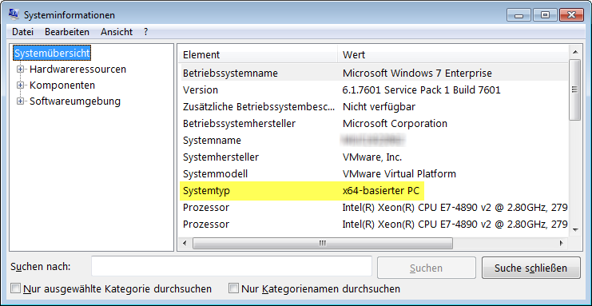
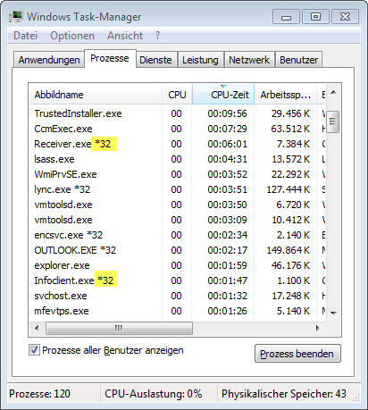

# Teamscale .NET Profiler

Test Gap analysis is a tool, which brings more transparency to the testing process. To this end, changes within an application are identified and matched against information about test execution. From a technical perspective, this requires two types of information:

* the source code at the current revision
* execution information, which is collected via the .NET Profiler

The profiler writes method coverage information of a .NET application into a report file (a.k.a. *trace file*). It uses the builtin .NET profiling interface and therefore can be used with any .NET application.

The trace file is created immediately after the first call of a .NET method. However, it remains mostly empty as long as the process runs. This avoids an unnecessary performance overhead due to file accesses. As soon as the process ends gracefully, the report is finished and all collected information is written to the trace file.

In the case of long running processes it must be taken into account that the report file is written only after the process has ended. In such a case, it must be ensured that the application is stopped and restarted in regular intervals or eager writing of the trace file is enabled.

# Using the GUI

To configure and launch the profiler, you can use the `GUI\ProfilerGUI.exe`. It lets you select the profiled application and the target directory to which traces should be written. From there you can launch the application with the profiler.

The GUI supports parsing `.lnk` shortcut files as well, i.e. it will read the executable, command line arguments and working directory from the `.lnk` files.

The configured values can be saved to disk. If you start the GUI with the command line argument `launchTargetApp`, the saved values will be used to directly launch the target application with the profiler attached. This is useful, e.g. to provide a one-click shortcut on the Desktop for testers to start their application with the profiler.

The GUI writes a log file to `GUI\ProfilerGUI.log`. Logging can be configured with `GUI\nlog.config`.


# Headless Usage

The .NET profiler supports both the .NET Framework and .NET Core runtime. For both variants the profiler has to be registered by environment variables before the application start. This can be achieved by either setting these variables in a startup script or by setting the variables globally. The former is preferred as otherwise all .NET aplications will be profiled.

The default directory where traces are written to is `C:\Users\Public`. See the Configuration section for specifying a custom output directory.

The second part of this documentation handles special environments like applications running on IIS or Azure.

## .NET Framework

### Determine which Profiler DLL to use

Before installing the profiler, it must be determined whether the x32 or x64 variant must be used. This does not always correspond to the installed operating system, but to the mode your application is executed in. Notably, if the application is started in 32bit mode on a 64bit machine, the 32bit version of the profiler must be used. In order to find out which profiler is the correct one for your application, you may use the *System Information* program that ships with Windows and look for *system type*:



* *x86-based PC*: use `Profiler32.dll`
* *x64-based PC*: check the Task Manager for your application's process. If your application runs in IIS, look for the IIS user mode worker process `w3wp.exe`.



* Entry shows `*32`, then use `Profiler32.dll`
* Otherwise use `Profiler64.dll`

### Registering the Profiler for the Target Application

From the last section, you should know which profiler is the right one in your setting. For simplicity, the installation of the 32bit profiler is described in the following. If you need the 64bit profiler, the name of the DLL file must be adjusted accordingly. If the application is run in a web application server, please make sure to also read section 'Web Applications'.

The profiler can be installed into any directory on the target machine, but we recommend the following steps:

1. Create directory `C:\Program Files\Coverage Profiler`.
2. Copy the `Profiler32.dll` file
3. Create and share a target directory where trace files can be written, e.g. `C:\Users\Public\Traces`. **Important:** The user whose account runs the analyzed application must have write access to this directory.
4. Good practice for client applications: Create a job that profiles the heartbeat application daily, including copying the created trace files into the shared directory.
5. Set the following environment variables for the user that starts the application or integrate the variables into the application's start scripts (using `set`). The latter is preferred:

| Environment variable | Value                                    | Description                              |
| :------------------- | :--------------------------------------- | :--------------------------------------- |
| COR_ENABLE_PROFILING | `1` (or `0`)                             | Required. Enables or disables the profiler |
| COR_PROFILER         | `{DD0A1BB6-11CE-11DD-8EE8-3F9E55D89593}` | Required. The GUID of the DLL file       |
| COR_PROFILER_PATH    | Path                                     | Required. Path to the 32 or 64 bit DLL file, `C:\Program Files\Coverage Profiler\Profiler32.dll` |

## .NET Core

.NET core is fully supported but requires different environment variables to be set. Most importantly the profiler is registered with variables having a `CORECLR_` prefix instead of the `COR_` prefix. Second, you do not have to know beforehand if the application is running in 32 or 64 bit mode, as the different profiler versions can be registered simultaneously with two environment variables.

| Environment variable    | Value                                    | Description                              |
| :---------------------- | :--------------------------------------- | :--------------------------------------- |
| CORECLR_ENABLE_PROFILING | `1` (or `0`)                             | Required. Enables or disables the profiler |
| CORECLR_PROFILER         | `{DD0A1BB6-11CE-11DD-8EE8-3F9E55D89593}` | Required. The GUID of the DLL file       |
| CORECLR_PROFILER_PATH_32 | Path                                     | Required. Path to the 32bit DLL file, e.g. `C:\Program Files\Coverage Profiler\Profiler32.dll` |
| CORECLR_PROFILER_PATH_64 | Path                                     | Required. Path to the 64bit DLL file, e.g. `C:\Program Files\Coverage Profiler\Profiler64.dll` |

Please note that the profiler is **still** configured with variables with the `COR_PROFILER_` prefix. This especially holds for the `COR_PROFILER_TARGETDIR`.

## Special Environments

### IIS / Web Applications

If the application is running in an IIS application server, the following steps need to be taken:

* Make the relevant application pool see the environment variables
* Regularly recycle the relevant application pool or configure eager mode

The environment variables must be set either system-wide or preferably for the account that runs the respective IIS app pool. For the latter, the app pool needs to have “Load User Profile” enabled in the Advanced Settings, and the environment variables need to be set for that user as follows:

* Go to IIS Manager, Application Pools, [App Pool], Advanced Settings, Process Model – Load User Profile, set to True. Also see http://www.iis.net/learn/manage/configuring-security/application-pool-identities
* Set the environment in the Registry (http://dotnetmonitor.vlasovstudio.com/2012/01/19/monitoring-a-net-application-running-in-iis/) 

Note that if the Application Pool is run under the `ApplicationPoolIdentity`, a special user will be created for just that single application pool. This only happens when Load User Profile is set to `True` after the pool is recycled once. These special pool users have SIDs that start with `S-1-5-82-`. Their profile image path ends with the name of the application pool.

As an alternative, the environment variables may be attached to the windows service running IIS instead of the user. Note that this causes ALL application pools to be profiled. This can be done in the registry by accessing
`HKEY_LOCAL_MACHINE\SYSTEM\CurrentControlSet\Services\[ServiceName]\Environment`
and setting the variables there. For IIS, the interesting services are `W3SVC` and `IISADMIN`.

In any case, when running inside IIS, the trace file will contain an additional line in the top section reporting the application pool ID as `IIS AppPool: [Your App Pool ID]`. This can be used to distinguish traces from different application pools running with the same environment variables, i.e. storing their traces in the same directory.

IIS must be restarted after setting the environment variables in order for them to have any effect (e.g. by running iisreset in an administrator command prompt). On more recent IIS versions (tested with IIS 7), if you set the variables for the app pool account and not the service, recycling the application pool is enough and a full restart is not required.

After restarting the IIS/recycling the pool and opening the application in a browser, a trace file should be created. As web applications are long running processes, it must be taken into account that the report file is written only after the process has ended, e.g. after stopping IIS, after stopping the profiled web site, or after recycling the application pool. In these cases, it must be ensured that the application is stopped and restarted in regular intervals or eager mode is enabled. In the case of IIS, we suggest to adjust the configuration to automatically recycle the application pool every night.

### Azure Cloud

If the application is running in an Azure App Service, the following steps need to be taken:

#### Install the Profiler

To deploy the profiler, [enable the Azure FTP account][AzureFTP] and upload the profiler DLLs to a location that will not be overwritten by a new app deployment, e.g., `D:\home\site\repository\profiler\`. To configure the profiler in Azure, go to the [application settings][AzureAppSettings] and add the environment variables as new application settings entries. You may use any configuration variable that the profiler supports. For the profiler target directory, you may use `D:\home\LogFiles` or a dedicated location, such as `D:\home\site\repository\profiler\traces` (remember to manually create this directory first).

#### Install the UploadDaemon

Deploy the upload daemon in the directory `.\UploadDaemon`, relative to the path where you deployed the profiler, e.g., in `D:\home\site\repository\profiler\UploadDaemon\`. Configure the trace upload as usual.

#### Schedule Trace Upload

By default, the profiler publishes traces when the app gets shut down (unless you configure "Eagerness"). Azure Apps are shut down automatically [in cases of user inactivity or at least every 29 hours][AzurePoolReset]. To use a different intervall, you can configure a different schedule in `D:\home\site\applicationHost.xdt`:

```xml
<?xml version="1.0"?>
<configuration xmlns:xdt="http://schemas.microsoft.com/XML-Document-Transform">
  <system.applicationHost>
    <applicationPools>
      <add name="yourappname" xdt:Locator="Match(name)"> <!-- fill app name -->
        <recycling xdt:Transform="Insert" >
          <periodicRestart>
            <schedule>
              <clear />
              <add value="03:00:00" />  <!-- adjust/add entries as needed -->
            </schedule>
          </periodicRestart>
        </recycling>
      </add>
    </applicationPools>
  </system.applicationHost>
</configuration>
```


  [AzureFTP]: https://docs.microsoft.com/en-us/azure/app-service/app-service-deploy-ftp
  [AzureAppSettings]: https://docs.microsoft.com/en-us/azure/app-service/web-sites-configure
  [AzurePoolReset]: https://docs.microsoft.com/en-us/azure/cloud-services/cloud-services-application-and-service-availability-faq#why-does-the-first-request-to-my-cloud-service-after-the-service-has-been-idle-for-some-time-take-longer-than-usual

# Profiler Configuration

The profiler has several configuration options that can either be set as environment variables or configured with an settings file. Environment variables will overwrite configured values from the configuration file.

## Environment Variables

| Environment variable              | Value                                    | Description                              |
| :-------------------------------- | :--------------------------------------- | :--------------------------------------- |
| COR_PROFILER_CONFIG               | Path                                     | Path to the profiler configuration file, e.g. `C:\Program Files\Coverage Profiler\profiler.yml` |
| COR_PROFILER_TARGETDIR            | Path, default `c:/users/public/`         | Target directory for the trace files, e.g. `C:\Users\Public\Traces` |
| COR_PROFILER_LIGHT_MODE           | `1` or `0`, default `0`                  | Enable ultra-light mode by disabling re-jitting of assemblies. |
| COR_PROFILER_ASSEMBLY_FILEVERSION | `1` or `0`, default `0`                  | Print the file and product version of loaded assemblies in the trace file. |
| COR_PROFILER_ASSEMBLY_PATHS       | `1` or `0`, default `0`                  | Print the path to loaded assemblies in the trace file. |
| COR_PROFILER_EAGERNESS            | Number, default `0`                      | Enable eager writing of traces after the specified amount of method calls (i.e. write to disk immediately). This should only be used in conjunction with light mode. |
| COR_PROFILER_PROCESS              | String (optional)                        | A (case-insensitive) suffix of the path to the executable that should be profiled, e.g. `w3wp.exe`. All other executables will be ignored. This option is deprecated. It is recommended that you use the mechanisms of the configuration file instead. |
| COR_PROFILER_DUMP_ENVIRONMENT     | `1` or `0`, default `0`                  | Print all environment variables of the profiled process in the trace file. |
| COR_PROFILER_IGNORE_EXCEPTIONS    | `1` or `0`, default `0`                  | Causes all exceptions in the profiler code to be swallowed. For debugging only. |

Please note that the profiler is **also** configured with variables starting with the `COR_PROFILER_` prefix in case of .NET Core applications.

## Configuration file

By default, the profiler will look for a YAML configuration file called `Profiler.yml` in the same directory as the profiler DLLs.

Example:

```yaml
match:
  # no executablePathRegex: or executableName: keys means match all processes
  - profiler:
      targetdir: "C:/users/public/traces"
      enabled: false
  # matches any foo.exe (case-insensitively)
  - profiler:
      executableName: foo.exe
      targetdir: "C:/users/public/traces"
      enabled: false
  # without quotes, the backlash need not be escaped
  - executablePathRegex: .*\\program\.exe
    profiler:
      enabled: true
  # with quotes, you must escape backlashes
  - executablePathRegex: ".*\\\\other_program\\.exe"
    profiler:
      enabled: true
  # with a folded block scalar, the backslash need not be escaped
  - executablePathRegex: >
      .*\\third_program\.exe
    profiler:
      enabled: true
```

You can have any number of sections under `match`. For each, the profiler will check if it matches the
currently profiled process. If it does, all options under `profiler` are applied in order. I.e. later sections
override previous ones if they both match the profiled process.

Matching against the profiled process' file name is supported via the `executableName` key. The comparison will
be done case-insensitively, i.e. `foo.exe` in the config will match `Foo.exe` on the file system.

Matching against the profiled process' path is supported via the `executablePathRegex` key. Its value is
a C++ ECMAScript-compatible regular expression that must match the entire path of the profiled process. If no `process`
property is given for a section, the section applies to all processes. Please note that these regular expressions
require special care when trying to use backlashes since these are used as an escape character by YAML under certain
circumstances.

If both `executableName` and `executablePathRegex` are specified in a section, both must match for the section to be
applied.

The options under the `profiler` key are the same ones from the environment, except the `COR_PROFILER_` prefix must be omitted.
Casing is irrelevant for these options. Additionally, you can use the `enabled` option to turn the profiler on or off.

Configuration options from environment variables always override configuration options from the configuration file.

Please note that you **cannot** register the profiler itself via the config file (`COR_PROFILER`, `COR_ENABLE_PROFILING`).


# Troubleshooting

You must ensure that the profiled application has read permissions to the location of the profiler DLL and write permissions in the target directory (`COR_PROFILER_TARGETDIR`). If the target directory is not set, does not exist, or is not writable by the process, no trace file can be created. Profiling can also be tested by starting any .NET application from the console. However, in this case a new shell must be started for the new environment variables to take effect. 

You can check whether the environment variables are visible to a certain process using the free [Microsoft Process Explorer](http://technet.microsoft.com/en-gb/sysinternals/bb896653.aspx):

1. Open Process Explorer, and look for the respective process (e.g. the IIS user mode worker process `w3wp.exe`).
2. Right click on the process, click Properties and then click the Environment tab.
3. Look for the `COR_ENABLE_PROFILING` and `COR_PROFILER` values.

The .NET runtime will create an error message to the event log if loading the profiler fails. This means that the environment variables were noticed by the runtime but the profiler crashed before it could be used.

Things to check if no trace files are written:

* Are the environment variables set correctly (see the table above)?
* Are the environment variables set for the right user?
* Does the application process have read rights on the profiler DLLs and read/write rights on the trace folder?
* Did you choose the correct DLL (`Profiler32.dll` vs. `Profiler64.dll`)?
* IIS: Is the application pool set to pick up the environment of its user?
* IIS: Did you recycle the application pool?

In case the application doesn't start at all, please check the file `C:\Users\Public\profiler_debug.log`.
It may contain stack traces in case the profiler crashed.

## Debugging Profiler crashes

If the debug log does not contain enough useful information, you can generate a minidump
to debug profiler crashes with WinDbg. To enable mini dumps, run the following as a `.reg` file:

    Windows Registry Editor Version 5.00

    [HKEY_LOCAL_MACHINE\SOFTWARE\Microsoft\Windows\Windows Error Reporting\LocalDumps]
    "DumpFolder"="C:\\Users\\Public"
    "DumpType"=dword:00000001
    "DumpCount"=dword:0000000a

A `.dmp` file will be generated in `C:\Users\Public`. You can set `DumpType` to `2` to get a full dump instead.
This may, however, be a rather large file since the entire program's heap will be dumped.


# Automatic Trace Upload

The profiler can automatically upload all produced trace files to Teamscale,
move them to a file system directory (e.g. a network share) or upload them to an Azure cloud storage.

To configure this

1. set the environment variable `COR_PROFILER_UPLOAD_DAEMON=1`
   or the corresponding YAML config file option
2.  configure the uploader process via the YAML config file.
3. __You must also specify the `targetdir` option of the profiler in the YAML config file.
   Otherwise, the upload daemon will
   not know where to find your trace files and nothing will be uploaded.__

In all cases, you must specify an assembly from which to read the program version via
the `versionAssembly` YAML config option.
This will be used to select the correct PDB files to map the trace file contents
back to source lines in the original code.

When properly configured, the uploader process will run in the background after the
profiler is launched for the first time. It writes a log file (`UploadDaemon.log`) to the
directory that contains the `UploadDaemon.exe`. To configure logging, you can edit the
`nlog.config` file in the same directory.

Futher config options for the uploader:

- `versionPrefix`: optional prefix to prepend to the assembly version when uploading to Teamscale

The following sections list several example config files.

## Example: Teamscale upload

**UploadDaemon.yaml:**

```yaml
match:
  - executableName: foo.exe
    profiler:
      targetdir: C:\output
    uploader:
      versionAssembly: YourAssembly
      teamscale:
        url: http://localhost:8080
        username: build
        accessKey: u7a9abc32r45r2uiig3vvv
        project: your_project
        partition: Manual Tests
```

## Example: Move to network share

**UploadDaemon.yaml:**

```yaml
match:
  - executableName: foo.exe
    profiler:
      targetdir: C:\output
    uploader:
      versionAssembly: YourAssembly
      directory: \\yourserver.localdomain\some\directory
```

## Example: Azure File Storage

**UploadDaemon.yaml:**

  To upload traces to an Azure File Storage first obtain the [connection string][azure-conn-str] for your storage account.

```yaml
match:
  - executableName: foo.exe
    profiler:
      targetdir: C:\output
    uploader:
      versionAssembly: YourAssembly
      azureFileStorage:
        connectionString: DefaultEndpointsProtocol=https;AccountName=storagesample;AccountKey=<account-key>;EndpointSuffix=core.chinacloudapi.cn;
        shareName: my-share
        directory: log/file/path
```

  [azure-conn-str]: https://docs.microsoft.com/en-us/azure/storage/common/storage-configure-connection-string

## Proxy

By default, the upload daemon will use the system-wide proxy settings. However, you can override this
behavior in the `UploadDaemon\UploadDaemon.exe.config` file. Examples are provided there for turning
off the proxy altogether and for using a different proxy.

## SSL certificates

By default, the upload daemon will validate SSL certificates and refuse to upload to endpoints with invalid
certificates. In case you must upload to an endpoint with a self-signed, certificate, you can use the
config option `disableSslValidation` to ignore invalid certificates.

This is insecure and not recommended.

# Build Process

In order to be able to interpret the generated coverage data, Teamscale needs access to the corresponding PDB files. These contain the mapping from the compiled assemblies back to the source code.
These files must be generated during your build process and must be available to Teamscale for every assembly in every version that is deployed to a test system.
The following steps need to be taken:

* Enable PDB file generation for your build by setting `/p:DebugType=pdb` in the MSBuild Arguments. It is recommended to set this once for the entire build and not on `.csproj` file level.
* Ensure that the PDB files are not deleted during the build process. If necessary, copy them to a separate location before packaging of your releases
* Make the location of the PDB files accessible to Teamscale

A specialized nightly job must be set up to pick up the PDB files and make them available to Teamscale.


# Setup Steps by Team Responsibilities

This document describes the necessary steps to introduce the Test Gap analysis in a .NET project. These steps are grouped by responsibilities. First, we detail necessary information that must be provided by the test team. Second, several information needs to be collected from the development lead. Then, technical measures are described that must be taken by operations group (DevOps). Finally, the actual creation of the dashboards by the Teamscale administrator is described.

## Test

A person who has a good overview of the test process and infrastructure of the application must provide the following information:

* Description of the test environments. Here the most interesting information is, whether there are areas that should be analyzed separately, e.g. tests done by the developers, tests done by an external test service or user acceptance tests. In this case, it is common to provide one dashboard per area plus one overall dashboard.
* Description of the application start and test procedure. This determines, whether the profiler must be registered in a start script or by setting user-specific environment variables. Furthermore, it must be determined if there are longer-running tests (e.g. overnight) that must be treated specially to get up-to-date results every day.

## Development

The application development lead must provide the following information: 

* Definition whether the application has a client and/or server part and which of those should be included in the analysis. Depending on this, the profiler will need to be installed on the server and/or the client machines.
* Which .NET framework version is used and whether the application is compiled as 32bit or 64bit assembly. This determines the profiler version to be used.
* Incrementing version numbers in the build. The analysis can only reliably distinguish between different versions of the application if each version of the application has its own distinct version number. These numbers must be in ascending order.
* Generating PDB files in the build. The analysis needs the PDB files to be able to map the coverage data from the binary files back to the source code. See the below section on builds for details.
* Select exclusion criteria. Some assemblies or types might be irrelevant for the Test Gap analysis and therefore must be excluded. Examples are test code, which does not need to be tested itself, or automatically generated types whose code is deliberately used only partially, that do not change over time and were generated by a trustworthy program.

## Operations

Operations (DevOps) must perform the following tasks:

* Installation of the profiler on the test machines (client and/or server, see the Installation section)
* Facilitating access to the traces and binaries. These can either be made available on the test machine via a shared folder or transferred to a network share after test.

## Teamscale Administrator

Once all the above-mentioned information is available and the Operations tasks have been completed, the Teamscale Administrator can create the dashboards:

* Creation of one or more dashboards, depending on the test environment.
* Customization of the dashboard, in order to collect the necessary data from the network share and start the preprocessing of the data.
* Setup of the exclusion criteria as parameters of the dashboard.

